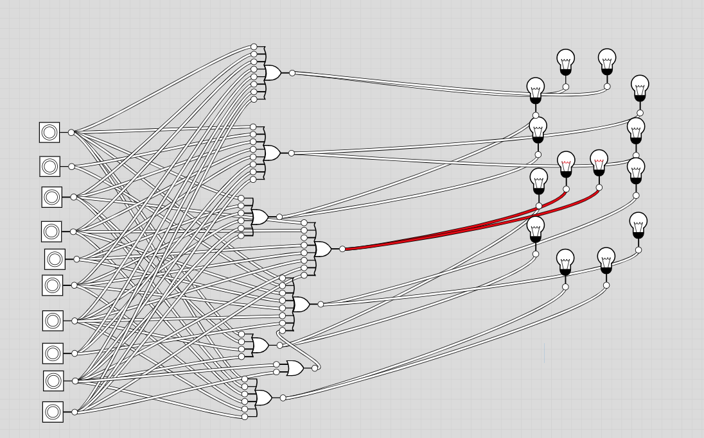
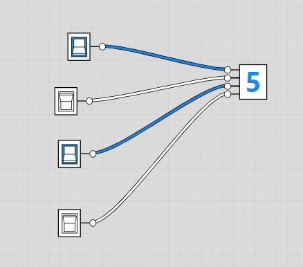
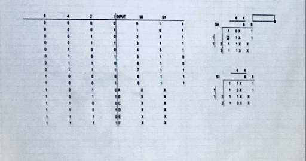

# **Day 2 - 1 Aug 2023**

## **ACTIVITY 1: SEVEN SEGMENT DISPLAYS AND K-MAPS**

A **K-MAP** maps the outputs to the inputs. It takes inputs and tables out the different outputs based on the yes/no of the inputs. It tends to express it in binary. 

Think of it in a seven-segment display. For the number 0, the top-most, top-right, and all the edge pieces want to be on. So there would be a 1 in each of those columns/rows in the k-map to represent that they're on, but not in the middle segment. And you can keep doing that for each of the different numbers. 
<br></br>

----

**Fig. 2.0: A SEVEN SEGMENT DISPLAY**
<br></br>



    What you see here are OR gates being attached to different buttons that when pressed make the different parts of the seven segment display. 

<br></br>

However, this can be made more simple by using a 4-bit binary input instead, represented by toggle switches. Four toggle switches can make all the displays based on the combination that is turned on.

----

**Fig. 2.1: A SEVEN SEGMENT DISPLAY WITH FOUR TOGGLE SWITCHES**
<br></br>



<br></br>

A k-map would be quite useful should someone want to attempt this "manually", using something like the light bulbs shown in Fig. 2.0. 

----

**Fig. 2.2: K-MAP EXAMPLE**
<br></br>



<br></br>
<br></br>

## **ACTIVITY 2: SHADERS**

**SHADERS** make 3D objects look better by representing light and doing similar things. They were developed to make a 3D scene. They usually run in parallel to the GPU. Games like Minecraft use shaders but if you have too many they slow down the game. 

Shaders use languages like **OpenGL** shading and **HLSL**.

The **Vertex** shader breaks down an object into the mesh and breaks down the vertices to be passed down to the **Geometry** shader, which computes the light that wound bounce off, etc. 

There are different kinds of shading. 

    We will be using a website called Shadertoy.com. 

<br></br>
----

Here's a shader code written in OpenGL:
```c
// MainImage is the entry point for our ShaderToy Program
// out and in is the information we're getting from the GPU and what we're sending back out.

void mainImage( out vec4 fragColor, in vec2 fragCoord ) 
{
    // Normalized pixel coordinates (from 0 to 1)
    
    // fragCoord is the coordinates of the pixel given to us being affected
    
    /* Dividing by iResolution.xy will divide xy of fragcoord by xy of iResulution and set the resulting xy as the xy of uv. This line keeps the value between 0 and 1. We must specify the .xy for iResulution because unlike fragcoord iResolution is a vex3 variable (you will see fragcoord is vec2) */
    
    vec2 uv = fragCoord/iResolution.xy; // divides the x and y values of the pixel (?)


    // Time varying pixel color
    vec3 col = 0.5 + 0.5*cos(iTime+uv.xyx+vec3(0,2,4));


    // Output to screen
    // Set the output bariable fragcolor to a vec4 variablewiht the RGB values and an alpha value of 1.0
    fragColor = vec4(col,1.0);
}

// vec2 is a data type used to store two objects. vec3 stores three, and vec4 uses 4.
```
    What this code does is change the color of the screen like a rainbow. The way it does this is that the GPU goes through this code and changes the color of each pixel individually. 
    
    Note the iTime variable, that changes based on how many seconds passed since the beginning of the animation's start. 

***Modern 3D game engines such as Unity and the Unreal Engine and 3D modelling software such as Blender run very quickly because they use both a vertex and fragment shader, and they perform a lot of optimizations for you. In Shadertoy, you don't have access to a vertex shader. You have to rely on algorithms such as ray marching and signed distance fields/functions (SDFs) to render 3D scenes which can be computationally expensive.***

***--inspirnathan.com***

<br></br>
<br></br>

## **ACTIVITY 3: ARDUINO**

***OBJECTIVE: The idea is a machine that if you get close to it, it will open up, and if you head away from it, it will close.***

- **Resistors** take away some of the energy so that you don't burn everything. 
- A **closed circuit** has electrons flowing while an **open circuit** does not.
- A **short circuit** is an electrical circuit of lower resistance than that of a normal circuit, typically resulting from the unintended contact of components and consequent accidental diversion of the current.

The **ultrasonic sensor** works by echolocation. It sends out a signal and waits to receive it, and the time it takes to receive it back variates directly with the distance between the sensor and the object.

**SOURCE CODE:**
```c
#include <Servo.h>

Servo servo;

const int trigPin = 3;
const int echoPin = 5;
const int servoPin = 9;

long duration;
int distance;


void setup() 
{
  // put your setup code here, to run once:;
  servo.attach(servoPin);
  pinMode(trigPin, OUTPUT);
  pinMode(echoPin, INPUT);

}

void loop() 
{
  // put your main code here, to run repeatedly:
  digitalWrite(trigPin, LOW);
  delayMicroseconds(2);
  digitalWrite(trigPin, HIGH);
  delayMicroseconds(10);
  digitalWrite(trigPin, LOW);

  duration = pulseIn(echoPin, HIGH);
  distance = (0.034 * duration)/2;

  if (distance <= 30)
  {
    servo.write(90);
    delay(5000);
  }else
  {
    servo.write(0);
  }

  delay(1);
}
```